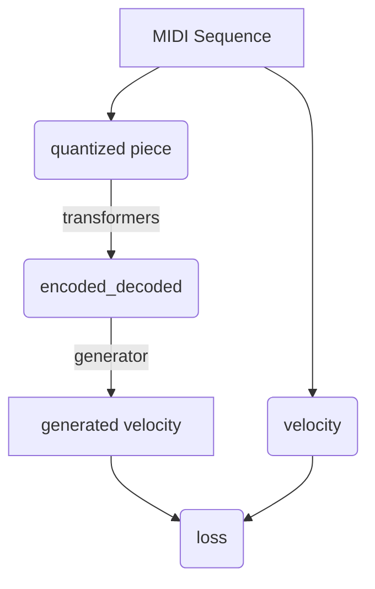

# MIDI Translation Transformers

### Overview
The point of this project was to use transformer to predict high-resolution MIDI data from low-resolution,
quantized MIDI notes.

## Training

Overview:



#### Training on gpu

You can thain the model on gpu simply by running
```shell
python train.py device=cuda:0
```

#### Tokenization method

You can train the model to learn to predict high-resolution velocity (128 values) from data quantized into from 2 to 10 bins.
When specifying number of bins you have to pass it as a string with following format:

```
bins="[n_dstart_bins] [n_duration_bins] [n_velocity_bins]"
```

For example, f you want to use 5 bins for dstart, 4 for duration and 7 for velocity, you need to specify bins hyperparameter:

```shell
python train.py bins="5 4 7"
```

#### Other hyperparameters

```
train:
  num_epochs: 5
  accum_iter: 10
  base_lr: 1.0
  batch_size: 16
  distributed: False
  label_smoothing: 0.1

dataset:
  dataset_name: "roszcz/maestro-v1"
  bins: "3 3 3"
  sequence_size: 128
device: "cpu"
warmup: 3000
log_frequency: 10
file_prefix: "to_vel"
run_name: midi-transformer-${now:%Y-%m-%d-%H-%M}
project: "midi-transformer"

model:
  n: 6
  d_model: 512
  d_ff: 2048
  h: 8
  dropout: 0.1
```

## Results

The model with parameters from above was trained for ~7.5h on GTX 960M and reached ~2.6 loss on val split of
maestro-v1 dataset as well as on giant-midi-sustain.

### Dashboard

To start the dashboard you need to run streamlit.

You can choose which dataset you would like to use by setting dataset.dataset_name parameter

If you are using roszcz/giant-midi-sustain you also need to change dataset_split parameter to "train", for example:
```shell
streamlit run --server.port 4466 dashboard.py dataset.dataset_name="roszcz/giant-midi-sustain" "dataset_split='train[10%]'"

```

#### Tokenization review dashboard

You can try out different tokenization methods i.e. different nuber of bins by
choosing Tokenization review option from "Display" selectbox.


#### Model predictions review

When you have trained your model, you can listen to and compare model predictions with original and target pieces.
Run the same command and choose "Model predictions" option.


#### Predict piece

You can choose a model to predict velocities of any piece from test dataset.


### Eval

You can evaluate your model and see the loss on the test dataset. For example if you have a model weights file called

```
10-10-3-to_vel_model-midi-transformer-2023-08-31-14-38-final.pt
```

You can run:

```shell
python evaluate.py run_name="2023-08-31-14-38" dataset.dataset_name="roszcz/maestro-v1-sustain"
```
