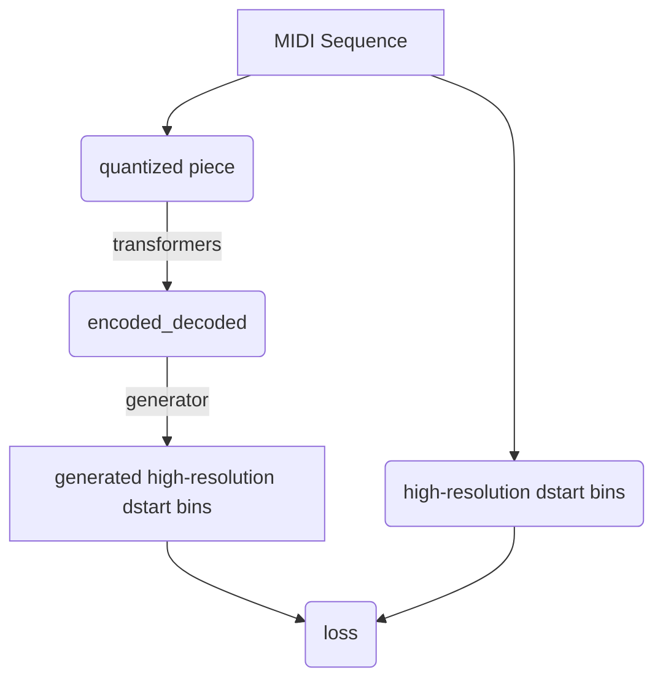

# MIDI Translation Transformers

### Overview
The point of this project was to use transformer to predict high-resolution MIDI data from low-resolution,
quantized MIDI notes.

## Training

**Overview:**
Velocity prediction:


Dstart prediction:


#### Training options

You can train the model to predict dstart:
```shell
python train.py --config-name=dstart_conf

```
or velocity:
```shell
python train.py
```

#### Tokenization method

You can train the model to learn to predict high-resolution velocity (128 values)
from data quantized into up to 10 bins.


For example, f you want to use 5 bins for dstart, 4 for duration and 1 for velocity, you need to specify bins hyperparameter:
```shell
python train.py dataset.quantization.dstart=5 dataset.quantization.duration=4 dataset.quantization.velocity=1
```

#### Other hyperparameters
```
train:
  num_epochs: 5
  accum_iter: 10
  base_lr: 1.0
  batch_size: 16
  distributed: False
  label_smoothing: 0.1

dataset_name: 'roszcz/maestro-v1-sustain'

dataset:
  sequence_len: 128
  sequence_step: 42

  quantization:
    duration: 3
    dstart: 3
    velocity: 3

device: "cuda:0"
warmup: 3000
log_frequency: 10
file_prefix: "to-vel"
run_name: midi-transformer-${now:%Y-%m-%d-%H-%M}
project: "midi-transformer"

model:
  n: 6
  d_model: 512
  d_ff: 2048
  h: 8
  dropout: 0.1
```

## Results

The model for velocity prediction, with parameters from above, was trained for ~7.5h on
GTX 960M and reached ~2.6 loss on val split of
maestro-v1 dataset as well as on giant-midi-sustain.

### Dashboard

To start the dashboard you need to run streamlit.

```shell
# Streamlit has issues with accepting it's run in the root directory
PYTHONPATH=. streamlit run --server.port 4466 dashboard/main.py
```

#### Tokenization review dashboard

You can try out different tokenization methods i.e. different nuber of bins by
choosing Tokenization review option from "Display" selectbox.


#### Model predictions review

When you have trained your model, you can listen to and compare model predictions with original and target pieces.
Run the same command and choose "Model predictions" option.


#### Predict piece

You can choose a model to predict velocities of any piece from test dataset.


### Code Style

This repository uses pre-commit hooks with forced python formatting ([black](https://github.com/psf/black),
[flake8](https://flake8.pycqa.org/en/latest/), and [isort](https://pycqa.github.io/isort/)):

```sh
pip install pre-commit
pre-commit install
```

Whenever you execute `git commit` the files altered / added within the commit will be checked and corrected.
`black` and `isort` can modify files locally - if that happens you have to `git add` them again.
You might also be prompted to introduce some fixes manually.

To run the hooks against all files without running `git commit`:

```sh
pre-commit run --all-files
```
